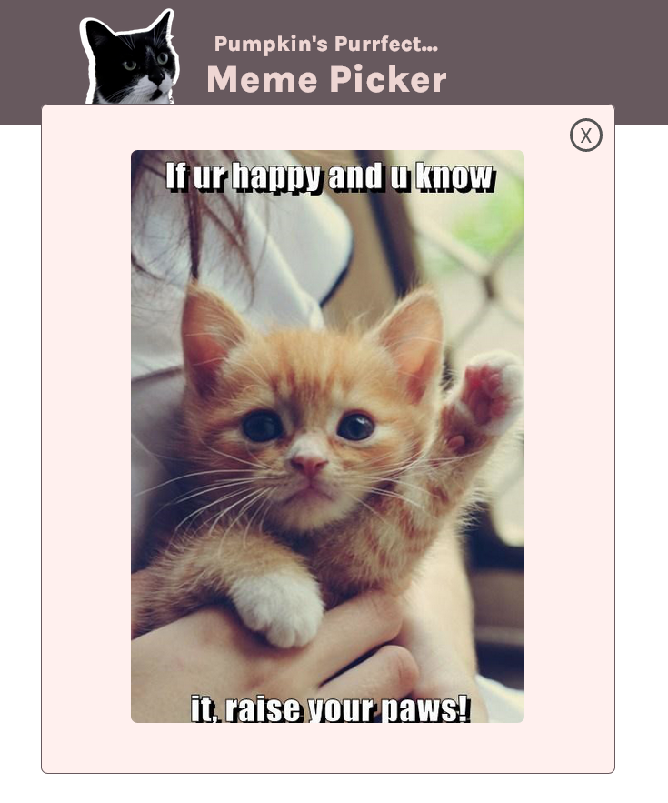

# Pumpkin's Purrfect Meme Picker | A Scrimba Project

Code developed during the Scrimba Frontend Dev Career Path, Essential JavaScript Concepts Module

## Table of contents

- [Overview](#overview)
  - [Requirements](#requirements)
  - [Screenshot](#screenshot)
  - [Links](#links)
- [My process](#my-process)
  - [Built with](#built-with)
  - [What I learned](#what-i-learned)
  - [Continued development](#continued-development)
  - [Useful resources](#useful-resources)
- [Author](#author)

## Overview

### Requirements

- Users should be able to select a meme type by emotion
- Users can choose to receive results as Gifs exclusively
- Users should see a random meme by selecting the 'Get Image' button
- Users should be able to close the meme modal by clicking the 'X'

### Screenshot





### Links

- Live Site URL: [Live Site on GitHub Pages](https://mattpahuta.github.io/cat-meme-picker/)

## My process

### Built with

- Semantic HTML5 markup
- Flexbox
- Vanilla JavaScript


### What I learned

This function illustrates a lot of essential JavaScript concepts covered in the tutorial, including using variables that reference boolean values (isGif) to filter results, targeting elements using attribute selectors ```js(document.querySelector('input[type="radio"]:checked')```, leveraging the includes() array method, and implementing ternary statements.

```js
function getMatchingCatsArray() {
  const isGif = gifsOnlyOption.checked; // check if gif option is selected
  if (document.querySelector('input[type="radio"]:checked')) { // handle clicks if no emotion selected
    const selectedEmotion = document.querySelector('input[type="radio"]:checked').value;
    const matchingCats = catsData.filter(cat => {
      // check if gif option is checked, return appropriate array of cat memes
      return isGif ? cat.emotionTags.includes(selectedEmotion) && cat.isGif : cat.emotionTags.includes(selectedEmotion);
    })
    return matchingCats;
  }
}
``` 

### Useful resources

- [Scrimba](https://www.scrimba.com) - This project was completed as a tutorial code-along from Scrimba, within in the Essential JavaScript module of the Frontend Developer Career Path/Bootcamp. Scrimba offers many outstanding tutorials and resources to get started with software development and a welcoming, supportive community. I highly recommend it. 


## Author

- Website - [Matt Pahuta](https://www.mattpahuta.com)
- Twitter - [@mattpahuta](https://www.twitter.com/MattPahuta)

